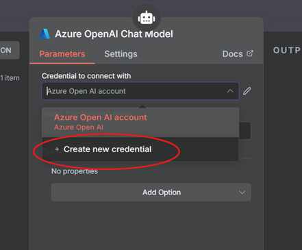

# Training: AI Agents bouwen in N8N

Deze training neemt je stap voor stap mee in het bouwen van een AI Agent in n8n.

Het doel is dat je niet alleen leert hoe je een werkende agent opzet, maar ook inzicht krijgt in de mogelijkheden en flexibiliteit van n8n. Je kunt de voorbeelden uit deze gids volgen, maar voel je vrij om hier en daar af te wijken en zelf te experimenteren. Vaak ontdek je tijdens het bouwen nieuwe ideeën die goed aansluiten bij je eigen workflow of use case.

Zie dit document dus niet als een strikte handleiding, maar meer als een route die je kunt aanpassen aan je eigen situatie. Aan het eind heb je niet alleen een AI Agent draaien, maar ook de kennis om deze verder uit te breiden of te integreren met andere tools.

Kortom: pak een kop koffie (of thee, of een energy drink – geen oordeel 😉), zet je creativiteit aan en laten we samen je eigen AI Agent bouwen.

## Benodigdheden

\- N8N (Trial) Account

\- Telegram account

\- Telegram desktop

## Niveau 1: Simpele Agent met een Brein, Geheugen en Tools. 

Navigeer naar n8n: Open n8n in je browser en zorg dat je bent ingelogd. Dit kan een lokale installatie zijn of de cloudversie, afhankelijk van hoe je n8n gebruikt.

Doel van deze eerste stap is het begrijpen hoe je een basisagent opzet in N8N met de AI Agent node en input via de Chat Trigger node.

Stappenplan:

1.  **Maak een nieuwe workflow in N8N.**

2.  **Voeg een Chat Trigger node toe.**

Je kunt nu de chat gebruiken om berichtjes te sturen. Test dit uit.

3.  **Voeg een AI Agent node toe en verbind deze met de Chat Trigger.**

Deze AI agent krijgt als input de data die je via de chat hebt
verstuurd. Test het maar eens uit, kun je voorspellen wat er gaat
gebeuren ?

Als de logs niet zichtbaar zijn moet je ze vanaf beneden aan het scherm
uitklappen.

De agent heeft nog geen brein (LLM model)! Die moeten we nog toevoegen.

4.  **Voeg een Azure Open AI chat model toe aan de Agent**

Je kunt hiervoor verbinden met een deployment binnen onze Azure
omgeving. Deze werkende key wordt na deze meeting verwijderd.

**Resource Name :** Azure-OpenAI-DDDB-FR

**API Version** : 2025-03-01-preview

**Endpoint** : <https://azure-openai-dddb-fr.openai.azure.com/>

**Api Key** : *in de teams chat*

Test connection zou groen moeten zijn.

**Model (Deployment) Name** = gpt-4o

Je hebt nu een brein ter beschikking !

Als je zelf een model ter beschikking hebt met credentials, kun je ook
voor die kiezen.

5.  **Test de workflow door een vraag te stellen via de chatinterface.**

## 

Je kunt handig meevolgen in de interface welke nodes actief zijn.

Bij de logs heb je een historie van de verschillende acties die
uitgevoerd zijn.

Vraag aan je Agent om met 5 verschillende use cases te komen voor
agentic workflows. Kies je favoriete nummer en vraag de Agent om die
nader toe te lichten. Wat merk je op? Kun je een goed gesprek voeren met
je agent ?

6.  **Memory toevoegen**

Je agent weet niet meer wat hij eerder heeft gezegd. Logisch want hij
heeft nog geen geheugen. Laten we die toevoegen op door op '+ Memory' te
clicken onder de Agent.

Er wordt gevraagd om een session ID in te vullen. Deze parameter is heel
belangrijk.

Automatisch staat het op Connected Chat Trigger Node. Dat betekent dat
de informatie in deze memory per chat sessie wordt opgeslagen. Bij elke
nieuwe sessie wordt alles gewist. Je kunt deze ook manueel instellen.

De Context Window Length legt vast hoeveel interacties hij maximum kan
onthouden.

Speel eens met deze 2 parameters om hen invloed beter te begrijpen.

Aan de linkerkant van het scherm zie je de input waar je Agent gebruik
van kan maken. Als je daar 'variables and context' openklapt, kun je
verschillende type informatie toeslepen naar de Session ID box.

7.  **Toolbox toevoegen**

De agent is bijna gereed. We kunnen communiceren, maar hij kan nog niets
voor me doen. Laten we een Agent bouwen die onze google calendar kan
beheren.

Verbindt met je google account en pas de settings aan.

Je zult twee tools moeten toevoegen.

1.  De agent moet de evenementen ophalen uit je eigen kalender

2.  De agent moet nieuwe evenementen kunnen creeeren

Test dit uit door vragen te stellen via de chat die wel of niet gebruik
moeten maken van de tools. Gaat alles goed ?

*Als je andere ideeen hebt, voel je vrij om die uit te proberen. Laat je
inspireren door alle integraties die binnen n8n bestaan.*

8.  **System Message invullen**

We hebben nog geen doel aan onze agent gegeven. En hij weet ook nog niet
zo goed wanneer hij welke tool zou moeten gebruiken. Meestal begin je
hier mee.

Ga naar de AI Agent's settings, en voeg een nieuwe 'System Message'
setting toe.

Hier kun je helder zetten wat het doel is van de agent en wat/wanneer
hij de verschillende tools moet gebruiken.

Tip : Je kunt een goede System Prompt laten schrijven door de LLM zelf
via de chat interface 😊

Test je systeem nog een paar keer totdat het doet wat je verwacht. Heeft
de system message de Agent verbeterd? Wat doet hij nog fout? Hoe zou je
dit op kunnen lossen ?

9.  **Telegram integratie**

De agent is nu klaar om je te helpen met je agenda. Maar het is super
vervelend om hiervoor op de n8n website in te moeten loggen. Je
spendeert veel tijd op je telefoon, dus je wilt het liefst deze workflow
kunnen uitvoeren zonder je computer er bij te betrekken.

(Voel je vrij om met een andere message service te integreren die beter
bij je past!)

Laten we een Telegram integratie toevoegen. Hiervoor zullen we de Chat
Trigger Node moeten vervangen door de Telegram 'Get a chat' trigger.
Deze kun je vinden door op telegram te zoeken in de Nodes Panel, en door
te klikken.

Ook voor telegram moet je een nieuwe credential aanmaken, door de
instructies te volgen :

[Telegram: Launch \@BotFather](https://telegram.me/BotFather)

Start deze bot (het wordt een extra gesprek op je telegram desktop) en
stuur het commando '/new bot' naar deze bot.

Je zult een leuke naam moeten verzinnen voor de bot. Wanner je klaar
bent krijg je een link om met de bot te activeren en er mee te chatten,
zowel als een Access Token om de bot van buitenaf te benaderen. Deze vul
je in de 'Create Credentials' in. Als het is gelukt wordt het groen.

De settings van de AI agent moeten geupdate worden zodat de User Prompt
(input) vanuit de Telegram trigger komt.

Om te testen of dit werkt moet je op 'execute workflow' clicken, en
daarna een bericht sturen naar de bot die verbonden is met n8n.
(andersom werkt ook).

Wanneer de flow goed is gerunned, wil je daar ook van op de hoogte
worden gehouden. Verbind daarom de AI Agent met een 'Telegram, send a
text message' node. Vul zelf de parameters in obv de input van de AI
Agent (die kan je krijgen door een succesvolle executie te runnen).

Full flow

Proficiat, je bent tot het einde gekomen. Je weet nu hoe je een LLM kunt
bouwen in een low-code environment, en je bent beter bewust van de
verschillende uitdagingen die hieraan vast hangen. Als je gebruikelijk
meer aan de high-code kant zit, hoop ik dat deze oefening je een beter
conceptueel beeld heeft kunnen geven van wat er onderwater gebeurt en
hoe de communicatie lijntjes lopen tussen de agent en de tools.

## Niveau 2 : Twee Agents + een Manager Agent

Doel: Hiërarchische communicatie met een manager-agent die de
communicatie doorspeelt naar de juiste agent.

Met de kennis uit Niveau 1, kun je nu een Hierarchish Agents systeem
bouwen.

Stappenplan:

1.  Maak 2 agenten aan met een specifiek doel. Je kunt voor alle agenten
    hetzelfde 'brein' gebruiken.

2.  Geef een op z'n minst een tool aan elke agent

3.  Maak een supervisor agent die verbonden is aan de 2 agenten via de
    'Tool' feature.

4.  Test de flow uit en kijk hoe de manager informatie delegeeert tussen
    de 2 agenten toe?

5.  Doet het wat je verwacht? Waarom wel, waarom niet? Kun je het
    probleem vinden door de logs te volgen ? Hoe zou je het kunnen
    oplossen? Denk aan System Messages en Memory.

***Bonus :***

-   Wat als het misgaat? Kun je error handling hier aan toevoegen ?

-   Kun je de logs van deze workflow wegschrijven naar een google sheet
    voordat je de text message binnenkrijgt op Telegram?

-   MCP is ook een van de beschikbare tools, kun je dit werkend krijgen?

## Niveau 3: Vindt een use case die jou zou kunnen helpen in je dagelijkse leven

Je hebt nu alle informatie tot je beschikking om iets te bouwen die jouw
kan helpen.

Zoek je inspiratie voor een project? Kijk dan op de n8n site naar al bestaande templates.
